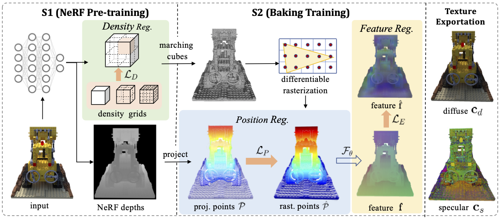

# MobileNeRF


The PyTorch implementation of the paper: “ATM-NeRF: Accelerating Training for NeRF
Rendering on Mobile Devices via Geometric Regularization”.

### [Project Page](https://cslinzhang.github.io/ATM-NeRF/) | [Paper]()| 



# Install

```bash
git clone https://github.com/dokidoki-yo/ATM-NeRF.git
cd ATM-NeRF
```

### Install with pip
```bash
pip install -r requirements.txt

# tiny-cuda-nn
pip install git+https://github.com/NVlabs/tiny-cuda-nn/#subdirectory=bindings/torch

# nvdiffrast
pip install git+https://github.com/NVlabs/nvdiffrast/

# pytorch3d
pip install git+https://github.com/facebookresearch/pytorch3d.git
```

### Build extension (optional)
By default, we use [`load`](https://pytorch.org/docs/stable/cpp_extension.html#torch.utils.cpp_extension.load) to build the extension at runtime.
However, this may be inconvenient sometimes.
Therefore, we also provide the `setup.py` to build each extension:
```bash
# install all extension modules
bash scripts/install_ext.sh

# if you want to install manually, here is an example:
cd raymarching
python setup.py build_ext --inplace # build ext only, do not install (only can be used in the parent directory)
pip install . # install to python path (you still need the raymarching/ folder, since this only install the built extension.)
```

### Tested environments
* Ubuntu 18.04 with torch 1.12 & CUDA 11.6 on a 3090 Ti.

# Usage

We support the original NeRF data format like [nerf-synthetic](https://drive.google.com/drive/folders/128yBriW1IG_3NJ5Rp7APSTZsJqdJdfc1), and COLMAP dataset like [Mip-NeRF 360](http://storage.googleapis.com/gresearch/refraw360/360_v2.zip).
Please download and put them under `./data`.

First time running will take some time to compile the CUDA extensions.

### Basics
```bash
### Stage0 (NeRF, continuous, volumetric rendering), this stage exports a coarse mesh under <workspace>/mesh_stage0/

# nerf
python main.py data/nerf_synthetic/lego/ --workspace trial_syn_lego/ -O --bound 1 --scale 0.8 --dt_gamma 0 --stage 0 --lambda_tv 1e-8

# colmap
python main.py data/garden/ --workspace trial_360_garden -O --data_format colmap --bound 16 --enable_cam_center --enable_cam_near_far --scale 0.3 --downscale 4 --stage 0 --lambda_entropy 1e-3 --clean_min_f 16 --clean_min_d 10 --lambda_tv 2e-8 --visibility_mask_dilation 50

### Stage1 (Mesh, binarized, rasterization), this stage exports a fine mesh with textures under <workspace>/mesh_stage1/

# nerf
python main.py data/nerf_synthetic/lego/ --workspace trial_syn_lego/ -O --bound 1 --scale 0.8 --dt_gamma 0 --stage 1

# colmap
python main.py data/garden/ --workspace trial_360_garden   -O --data_format colmap --bound 16 --enable_cam_center --enable_cam_near_far --scale 0.3 --downscale 4 --stage 1 --iters 10000

### Web Renderer
# you can simply open <workspace>/mesh_stage1/mesh.obj with a 3D viewer to visualize the diffuse texture.
# to render full diffuse + specular, you'll need to host this folder (e.g., by vscode live server), and open renderer.html for further instructions.
```

# Acknowledgement
* The rasterization framework is based on [NeRF2Mesh](https://github.com/ashawkey/nerf2mesh).
* The NeRF framework is based on [torch-ngp](https://github.com/ashawkey/torch-ngp).
* The GUI is developed with [DearPyGui](https://github.com/hoffstadt/DearPyGui).

# Citation
